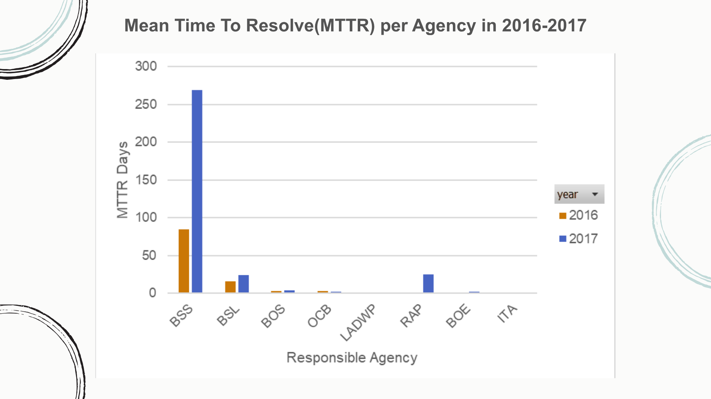
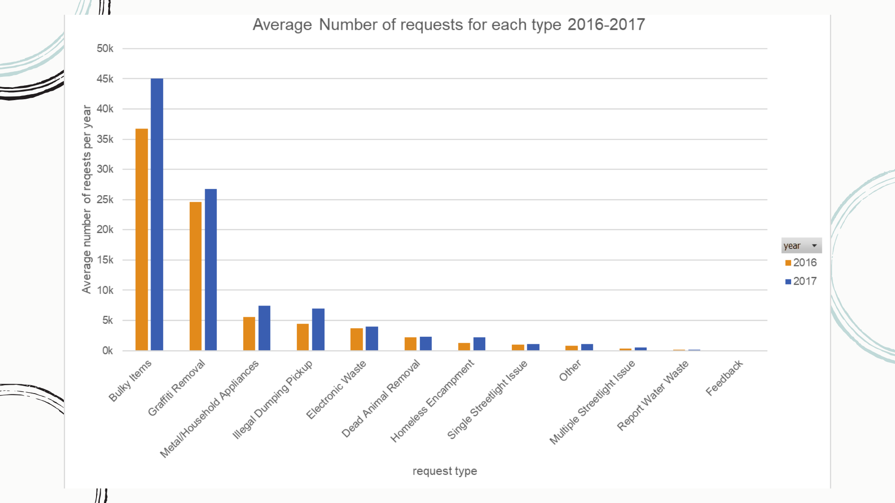
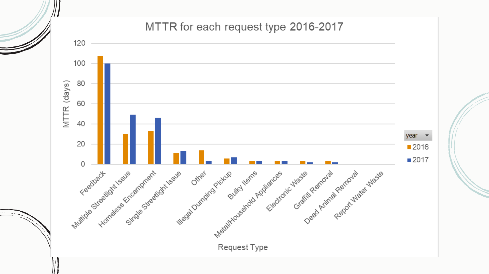

# Citi311-Analysis
Analysis for LA's Citi 311 dataset, using PortgreSQL

### Introduction
Day by day, 3-1-1 contact centers have become a necessity for residents to access the non-emergency services they need. These centers serve asa reminder that just because a situation is non-emergent doesn’t mean it’s not urgent. However, as the years go by, the number of requests raised for these centers has increased significantly as well as the wait time until the requests are resolved.

### Problem Statement
Between 2016 and 2017, in Los Angeles*, the number of request raised for Non-emergency services was higher by %17. Also, citizens has to wait for an average of 4 days for their requests to be resolved. This could result the dissatisfaction of residents, and in a failure to adhere to Service Level Agreements(SLAs) could cost responsible agencies to pay penalties.

** *Excluded neighborhood_council_ids (0,44,24) because the ids are not unique.**

### Approaches
1. Is there a delay in resolving requests per year for each Responsible agency? and what can we do to improve their performance?
2. What are the requests that are most common amongst residents over the years? and can we reduce their frequency by providing other solutions?
3. How long does it take for each request type to be resolved on average; where the Mean Time To Resolve was Higher than 4 days(Overall average)? and what can we do about it?

### Viusalizations

** *NOTE: < 1 day for MTTR = 0 days**

#### Key Findings
1. BSS, BSL, RAP are take a long time to resolve issues (+4 days).
2. Bulky items and Graffiti removal requests are the top 2 request types.
3. In both 2016-2017, multiple request types had an MTTR which was above the average (4 days). Feedback had the highest in both years, with 107 days in 2016 and 100 days in 2017.

### Recommendations
LA could implement a few of the following solutions to improve non-emergency service performance and decrease numbers of requests:
1. Implementing a priority system
2. Agents Training and Support
3. Increase Survalliance

### Future Work
With more data, we could compare Mean Time To Resolve (MTTRs) with Service Level Agreements(SLAs) per responsible agency, and analyze whether smartphone usage played a role in increasing the number of requests each year.

